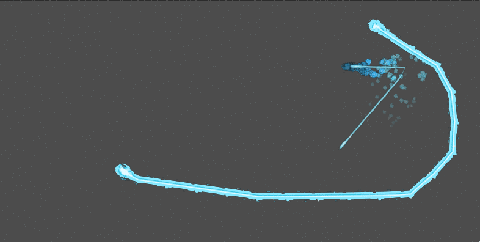

# godotShapeTrails2D
Scripts and scene components to make trails2D in godotEngine

Check demo scene.

There are two main scripts:

	*trails
	*trail_maker

## trails.gd
The first one let you draw a trail along an ArrayVector or curve using three sprites ( head, body, tail)
head and tail only would be drawn one time, body will be repeated.

You need apply this script to a Path2D type node.

Start Draw check, let you draw a trail one time.

Be sure to provide first an ArrayVector of points, or curve.
If you add a curve change it bake interval parameter to fix amount of points.
Adjust radio ( trail  width)

Active collisions check add a shape to an Area2D or StaticBody2D node added previously to Path2D Trail node.

## trail_maker.gd
The second script "trail_maker" create an ArrayVector2d from  the target position coordinates, step distance set distance between points.

Need to be used in a Node2D, and get a trail node as a first child. 

First assign target node, be sure this node it's not a child of this script node.

You can active or desactive generation of points.

Max limit let you to limit total amount of points.

Active collision set this property in Trail child node. 
